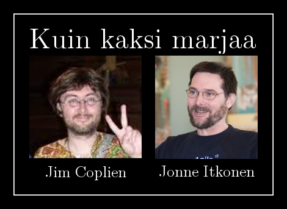

Tipuin tuolilta <a href="http://agilefinland.com/">Agile Finlandin</a> <a href="http://confluence.agilefinland.com/display/af/Agile+Seminar+in+Tampere+2012-05-22">seminaari-ilmoitusta</a> lukiessa.  Oli <em>ihan</em> pakko.

